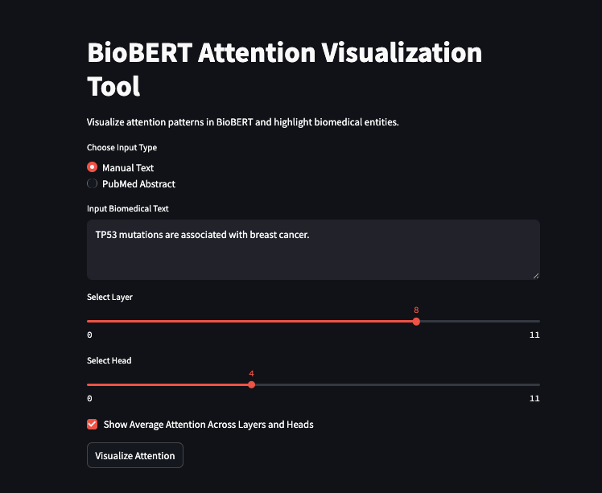
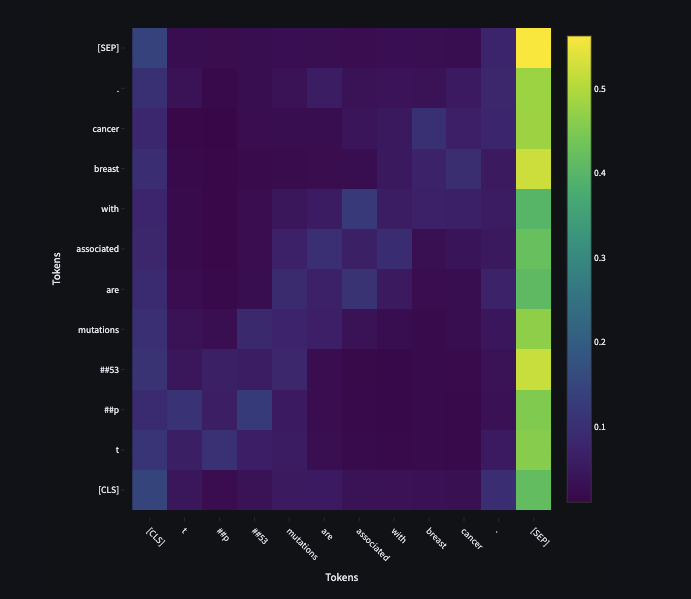

# BioBERT Attention Visualization Tool

A Streamlit-based tool to visualize attention mechanisms in BioBERT for biomedical text. Users can input sentences or fetch PubMed abstracts, explore attention patterns via interactive heatmaps, and highlight biomedical entities like genes and diseases using scispacy.

## Features
* **Load BioBERT**: Extracts attention weights from the BioBERT model.
* **Visualize Attention**: Displays token-to-token attention with Plotly heatmaps.
* **Detect Entities**: Identifies biomedical entities (e.g., genes, diseases) using scispacy.
* **Fetch PubMed Abstracts**: Retrieves abstracts via the EuropePMC API.
* **Interactive UI**: Built with Streamlit for seamless user interaction.

## Installation
Follow these steps to set up the project locally:

1. **Clone the Repository**:
```bash
git clone https://github.com/quantnexusai/bioattention-viz.git
cd bioattention-viz
```

2. **Set Up a Virtual Environment**:
```bash
python -m venv bioattention_env
source bioattention_env/bin/activate  # On Windows: bioattention_env\Scripts\activate
```

3. **Install Dependencies**:
```bash
pip install -r requirements.txt
```

**Note for macOS Users**: If you encounter `zsh` errors with version specifiers (e.g., `>=`), use quotes (e.g., `pip install "torch>=2.0.0"`) or install via `requirements.txt`.

## Usage
1. **Run the Streamlit App**:
```bash
streamlit run app.py
```

This opens the app in your browser.

2. **Explore the Tool**:
   * **Manual Text**: Enter a biomedical sentence (e.g., "TP53 mutations are associated with breast cancer").
   * **PubMed Abstract**: Search for abstracts (e.g., "TP53 breast cancer") and fetch one to analyze.
   * Select a layer and head, or view average attention across all layers and heads.
   * Visualize attention heatmaps and see detected entities.

## Portfolio Outputs
* **Blog Post**: Visualizing Attention in Biomedical Transformers: From Proteins to Pathways (coming soon).
* **Demo Video**: Watch the demo (coming soon).

## Screenshots
Below is a screenshot of the app in action, showing the UI for fetching a PubMed abstract and visualizing attention:





## Dependencies
* Python 3.8+
* torch>=2.0.0
* transformers>=4.30.0
* streamlit>=1.20.0
* plotly>=5.10.0
* numpy>=1.23.0
* pandas>=1.4.0
* requests>=2.28.0
* scispacy>=0.5.1
* en_core_sci_sm

See `requirements.txt` for the full list.

## Troubleshooting
* **Dependency Issues**:
   * Ensure all dependencies are installed via `requirements.txt`.
   * For `torch` on macOS (Apple Silicon), use: `pip install "torch>=2.0.0"`.
   * If `scispacy` fails, reinstall the model: `pip install https://s3-us-west-2.amazonaws.com/ai2-s2-scispacy/releases/v0.5.1/en_core_sci_sm-0.5.1.tar.gz`.
* **Streamlit Errors**:
   * If the app doesn't load, check for missing modules (e.g., `pip install streamlit`).
   * Ensure sufficient memory (~8GB RAM) for BioBERT.
* **PubMed Fetching**:
   * If no abstracts are fetched, verify internet access or try a different query (e.g., "breast cancer").

## Future Improvements
* Add support for other models like PubMedBERT.
* Highlight entities directly in the attention heatmap.
* Deploy the app on Streamlit Cloud for public access.

## License
MIT License. See LICENSE for details.